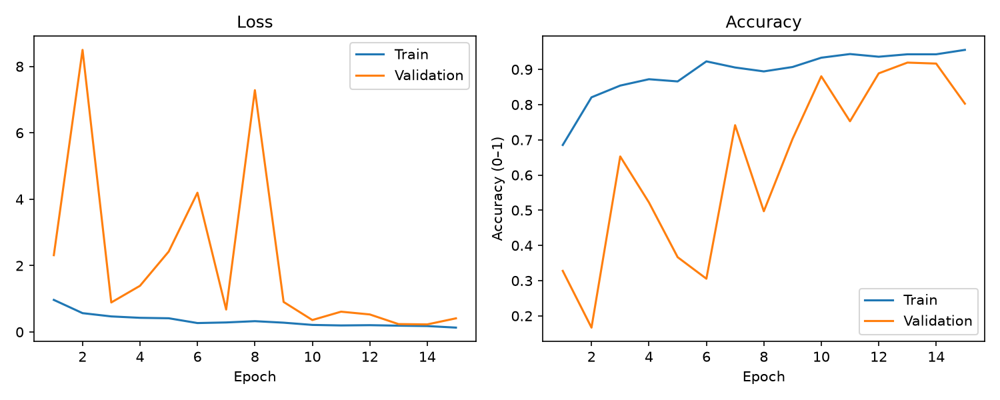
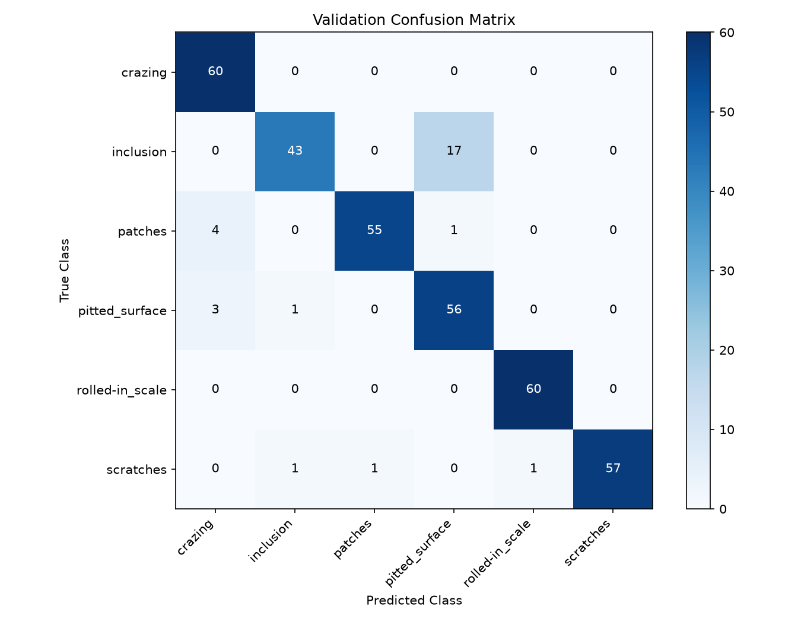

# 金属表面缺陷图像分类

使用 PyTorch 实现小型 ResNet，对六类钢材表面缺陷进行分类。项目包含数据检查、类别统计、模型训练、单张图片预测和错误分析，作为图像分类学习与实验项目，不用于直接替代工业质检。

## 数据

数据来自 Kaggle 上 Kaustubh Dixit 发布的 **NEU Surface Defect Database**。可在 [Kaggle 搜索页面](https://www.kaggle.com/search?q=NEU+Surface+Defect+Database) 找到该数据集。下载前请查看发布页面的使用许可；本仓库不重新分发数据，数据集确切许可尚待核实。

本次下载的目录名称为 `NEU-DET`，同时包含图片和目标检测标注。本项目只用类别文件夹中的图片做分类，不使用 `annotations`，也不实现缺陷位置检测。

| 标签 | 中文含义 | 训练数量 | 验证数量 |
|---|---|---:|---:|
| crazing | 裂纹 | 240 | 60 |
| inclusion | 夹杂 | 240 | 60 |
| patches | 斑块 | 240 | 60 |
| pitted_surface | 麻点 | 240 | 60 |
| rolled-in_scale | 轧制氧化皮 | 240 | 60 |
| scratches | 划痕 | 240 | 60 |

共 1800 张，读取检查显示图片均为 RGB、200×200；1800 张图片均成功解码。像素重复检查发现训练集内部有一组相同图片：`patches_101.jpg` 与 `patches_105.jpg`，未发现训练集与验证集之间像素完全相同的图片。原始数据和本次训练划分保留不变；此检查不能排除近似图片或同一场景造成的泄漏。

解压后确保结构如下，不能多套一层 `archive` 文件夹：

```text
data/raw/NEU-DET/
├── train/
│   ├── annotations/
│   └── images/
│       ├── crazing/
│       ├── inclusion/
│       ├── patches/
│       ├── pitted_surface/
│       ├── rolled-in_scale/
│       └── scratches/
└── validation/
    ├── annotations/
    └── images/
        └── 与 train 相同的六个类别目录
```

## 安装

本次实验环境：Windows、Python 3.12.10、PyTorch 2.14.1+cpu、torchvision 0.29.1+cpu。使用 CPU，无需 CUDA。完整依赖版本记录在 `requirements.txt` 中。

在项目根目录打开 PowerShell，逐条执行：

```powershell
py -3.12 -m venv .venv
.venv\Scripts\python.exe -m pip install torch==2.14.1+cpu torchvision==0.29.1+cpu --index-url https://download.pytorch.org/whl/cpu
.venv\Scripts\python.exe -m pip install -r requirements.txt
```

已有 `.venv` 时不必重新创建。下面的命令直接使用虚拟环境解释器，不需要先激活环境。

## 运行步骤

所有命令均在项目根目录执行。

### 1. 数据检查和分布图

```powershell
.venv\Scripts\python.exe inspect_dataset.py
.venv\Scripts\python.exe check_duplicates.py
.venv\Scripts\python.exe visualize_data.py
```

生成 `outputs/image_info.csv`、`outputs/duplicate_check.txt` 和 `outputs/class_distribution.png`。

### 2. 训练

```powershell
.venv\Scripts\python.exe src/train.py
```

默认输入 64×64，batch size 为 16，Adam 学习率为 0.001，交叉熵损失，训练 15 轮。按验证准确率保存最佳权重，输出：

- `checkpoints/best_model.pth`：包含模型参数、类别映射、输入尺寸和最佳轮次。
- `outputs/training_history.csv`：每轮训练与验证指标。

每次运行都从头训练，并覆盖上述结果；保留已有实验时应先备份。代码尚未固定随机种子，重新训练的数值不保证与本次记录一致。

### 3. 画训练曲线

```powershell
.venv\Scripts\python.exe plot_training.py
```

生成 `outputs/training_curves.png`。图形窗口关闭后程序结束。

### 4. 评估最佳模型

```powershell
.venv\Scripts\python.exe src/evaluate.py
```

生成混淆矩阵 CSV 和图片，打印各类召回率及夹杂误判为麻点的样本路径。行是真实类别，列是预测类别。需先有模型权重及验证图片。

### 5. 指定图片预测

```powershell
.venv\Scripts\python.exe src/predict.py "data/raw/NEU-DET/validation/images/inclusion/inclusion_250.jpg"
```

将引号中的路径替换成待预测图片路径即可，也支持绝对路径。程序输出图片名、所在文件夹和预测类别；所在文件夹不自动视为真实标签。

示例使用验证图片，只用于演示预测流程，不构成独立新数据测试。模型适用于相近的钢材缺陷图像，不保证能识别任意现场照片。

## 模型结构

`src/model.py` 中编写了残差块和网络组装，没有调用现成的 `torchvision.models.resnet18`。

```text
RGB 图片 [B,3,64,64]
→ 初始卷积 [B,16,64,64]
→ 残差块 [B,16,64,64]
→ 下采样残差块 [B,32,32,32]
→ 下采样残差块 [B,64,16,16]
→ 全局平均池化 [B,64,1,1]
→ 展平和全连接 [B,6]
```

每个残差块包含两个 3×3 卷积。输入输出形状相同时使用直接捷径；通道或尺寸变化时，用 1×1 卷积调整捷径后相加。该模型是小型残差网络，不是标准 ResNet-18，也没有使用预训练权重。

## 本次实验结果

最佳轮次为第 13 轮：验证集 331/360 张正确，准确率 **91.94%**。这是用于选择最佳模型的验证集成绩，不是独立测试准确率。

| 类别 | 正确 / 总数 | 召回率 |
|---|---|---:|
| crazing | 60/60 | 100.00% |
| inclusion | 43/60 | 71.67% |
| patches | 55/60 | 91.67% |
| pitted_surface | 56/60 | 93.33% |
| rolled-in_scale | 60/60 | 100.00% |
| scratches | 57/60 | 95.00% |





主要错误为 17 张夹杂图片被识别为麻点。实际观察发现，两类的暗色纹理有部分重叠，夹杂内部也有点状、条状和成片等差异，但目前没有实验证明具体误判原因。验证曲线波动明显，原因尚未定位。

详细观察与限制见 [实验记录与错误分析](docs/实验记录与错误分析.md)。

## 文件说明与权重获取

- `src/model.py`：网络结构。
- `src/train.py`：训练、验证和保存权重。
- `src/predict.py`：指定图片路径预测。
- `src/evaluate.py`：验证集评估与混淆矩阵。
- `inspect_dataset.py`、`visualize_data.py`：数据统计与图表。
- `plot_training.py`：训练曲线。
- `outputs/`：统计表和实验结果。
- `docs/`：实验说明。

原始数据、虚拟环境、模型权重及本地学习进度不上传 Git。当前尚未发布权重下载链接，可按训练步骤生成权重；正式交付时需另附本次最佳权重，并放入 `checkpoints/best_model.pth`，才能复现本次模型的预测结果。

## 参考与 AI 辅助

数据集来自上述公开数据源；实现使用 PyTorch、torchvision、Pandas、NumPy、Matplotlib 和 Pillow。AI 用于概念解释、代码示例、排错和文档整理；实验数值来自实际运行，图片观察来自本人检查。项目未提出新的算法，目前也未完成迁移学习对照实验。
